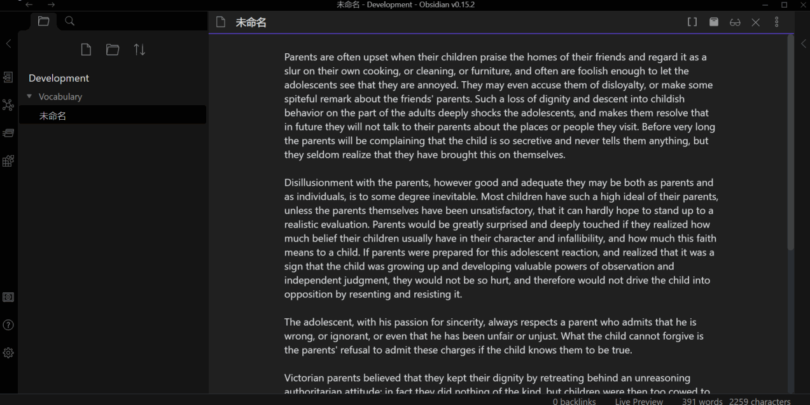
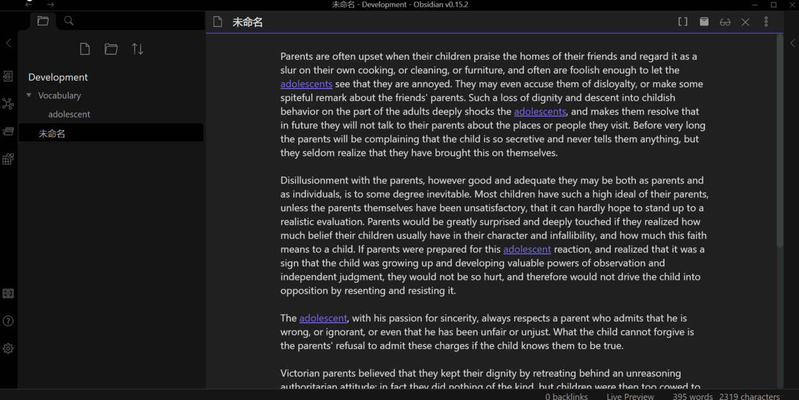
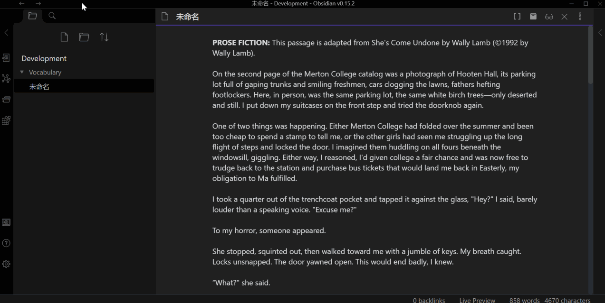

# Obsidian English Learning Plugin

This plugin helps you learn English when reading passages, a bit like lingq.

## Features

### Mark as known/unknown

Right click on a word to mark the word as known or unknown.

### Mark article

Click the bracket button on the page header, and all unknown words in a passage got marked.

This is based on your database, so please do this ONLY after you have fed enough data into your database.

As you see, this process has some flaws (for example it tells me the original form of 'was' is 'wa', wth?) and takes some time due to requesting to dictionary API for word meanings. Considering add local dictionary in the future.

### Learn article

Click the box button on the page header, and all words not marked as unknown will be marked as known.

## Explanations

### Mark a word as unuknown

Create a bidirectional link and a meaning file so that you can see the words meaning by hovering on the word. Words will be automatically converted into its original form. 

For examle, when marking the word 'adolescents' as unknown, all words whose original form is 'adolescent' in the passage will become a bidirectional link, and for the specific word 'adolescents', it will become '[[adolescents|adolescent]]'. At the same time, a meaning file for 'adolescent' will be created in the vocabulary folder(can be configured in settings). 

**The word will be marked as unknown in the database.**

### [Mark a word as known](#mark-as-knownunknown) 

All links to the word will be replaced with the original word. The meaning file will be deleted.

**The word will be marked as known in the database.**

### [Mark article](#mark-article)

Mark all unknown words in a article.

To be specific, 'all unknown words' refers to all words except those marked as known in your database. 
However, initially no word is marked as known in the databse since it's empty.

So **DON'T** do this unless you have fed your database with enough data.

### [Learn article](#learn-article)

Mark all words except those already marked as unkown in an article as known in your database.

A great way of **feeding database with data**, but be sure to first mark those words that you don't know unkown.

### [Initialize database](#initialize-database)

There is a list with high frequency words ranked from high frequency to low frequency in the "/data" folder under this plugin's folder. 

This command will ask you whether you know this word or not to estimate your vocabulary and mark all words it thinks you know as known in the database.

Be careful because as this command uses simple binary search rather than any complicated algorithm, it may mark some words that you don't know as known.

This is only for a quick setup, the best method known is still to feed the database with articles.

## Recommended way of using the plugin

### Initialize database

First, you should initialize your database. 

There are two ways of initializing you database: using the command 'Initialize Database' or manually feed it data using [Learn Article](#learn-article).

The first way is quite simple: just execute the command using command palete and answer the questions. This method is fast but somehow unstable, because this command may mark some words that you don't know as known.

The second way is more complicated. You need to collect some articles, read them, mark unfamiliar words as unknown, and learn the article. This method is more complicated but more stale, for all the words you mark as unknown are indeed the words that you don't know.

### Use the plugin

Then you can start reading articles!

Simply open the markdown file and start reading. You may mark all unknown words manually or use [Mark Article](#mark-article).

If you use the second method, you may need to manually mark some words as known because there might be some words that you know but not in the database. 

This is also a process of feeding data to your database.
### Configuration

#### Vocabulary File Path
The path from vault root to the folder where meaning files are stored.

Please be careful when modifying it if there are too many meaning files, because those files will be moved to new folders on settings change, so it may be a little time-consuming. 

I have never tested that and in theory there shouldn't be any problem, but still be careful.

You can put articles wherever you want except in the Vocabulary File Path.

#### General Template

A template that controls the format of meaning files generated.

Available variables:

`{{word}}`: The word itself.

`{{origin}}`: The origin of the word.

`{{phonetics}}`: The phonetics of the word. Can be configured in [Phonetic Template](#phonetic-template).

`{{meanings}}`: The meanings of the word. Can be configured in [Meaning Template](#meaning-template).

#### Meaning Template

Available variables:

`{{partOfSpeech}}`: The word's part of speech.

`{{definitions}}`: The definition of the word. Can be configured in [Definition Template](#definition-template).

#### Phonetic Template

Available variables:

`{{text}}`: The text form of the phonetic.

`{{audio}}`: The link to the sound of the phonetic(not necessarily exist).

#### Definition Template

Available variables:

`{{definition}}`: The definition of the word.

## Advanced

### Repository structure